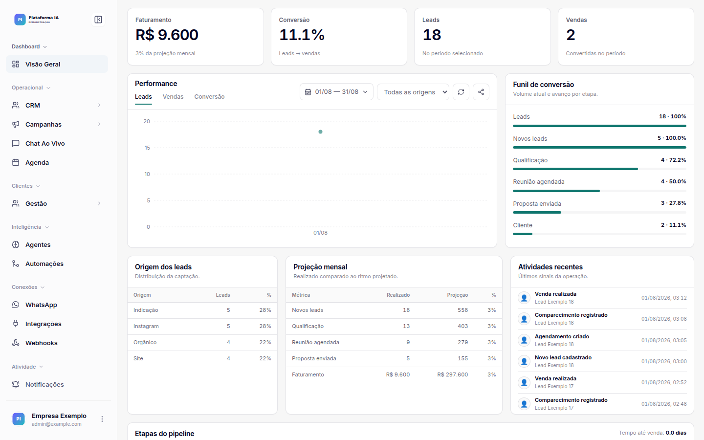
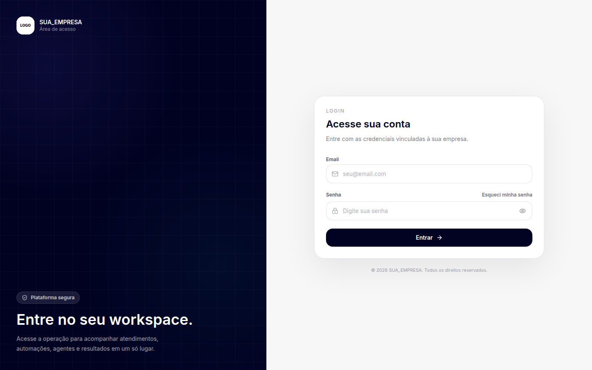

# BrainfyOS

Plataforma full stack para criar e operar agentes de IA, CRM, fluxos, automações, campanhas e integrações de WhatsApp.

- Produção: <https://app.brainfyos.com.br>

## Stack

- Backend: Python 3.12, FastAPI, SQLAlchemy e Alembic.
- Banco: PostgreSQL 15 ou superior.
- Filas e eventos em tempo real: Redis e Celery.
- Frontend: React 18, TypeScript, Vite 7 e Tailwind CSS.
- WhatsApp: WAHA, opcional para quem habilitar os recursos de mensageria.

SQLite não é suportado. O modelo usa recursos próprios do PostgreSQL, como `JSONB` e `ARRAY`.

## Visão da plataforma

As telas abaixo usam dados fictícios.

### Dashboard



### CRM


### Login



## Documentação

Roteiro de instalação, partindo de um banco vazio:

1. [Pré-requisitos](docs/public/01-pre-requisitos.md)
2. [Instalação local](docs/public/02-instalacao-local.md)
3. [Banco de dados e primeiro administrador](docs/public/03-banco-de-dados.md)
4. [Variáveis de ambiente e integrações](docs/public/04-configuracao.md)
5. [Nome, logo e identidade visual](docs/public/05-personalizacao.md)
6. [Deploy no servidor (modelo genérico)](docs/public/06-deploy.md)
7. [Solução de problemas](docs/public/07-troubleshooting.md)
8. [Checklist pós-clone](docs/public/08-checklist-pos-clone.md)

Para o deploy real desta instalação, use **[docs/DEPLOY-BRAINFYOS.md](docs/DEPLOY-BRAINFYOS.md)**, que documenta o servidor, os serviços systemd e o Nginx em produção.

## Desenvolvimento local

```bash
git clone git@github.com:brainfyos/brainfyos.git brainfyos
cd brainfyos

python3.12 -m venv .venv
source .venv/bin/activate
python -m pip install --upgrade pip
python -m pip install -r backend/requirements.txt

cp .env.development.example backend/.env
cp frontend/.env.development.example frontend/.env.local

npm --prefix frontend ci
```

Preencha os dois arquivos locais, crie o PostgreSQL e então execute:

```bash
cd backend
alembic upgrade head
cd ..

python -m backend.scripts.bootstrap_admin \
  --email admin@brainfyos.com.br \
  --company-name "BrainfyOS" \
  --document 00000000000000
```

A senha do primeiro administrador é solicitada de forma oculta; não existe senha padrão.

Não existe autocadastro. O primeiro acesso é criado pelo bootstrap e as demais contas ou workspaces são administrados por usuários autorizados dentro da plataforma.

Com PostgreSQL e Redis ativos, abra dois terminais:

```bash
# Terminal 1, na raiz do projeto e com o venv ativo
python -m uvicorn backend.main:app --env-file backend/.env --reload --host 127.0.0.1 --port 8002
```

```bash
# Terminal 2
npm --prefix frontend start
```

## Identidade visual

A marca vive em dois lugares:

- Variáveis `VITE_APP_NAME`, `VITE_APP_DESCRIPTION`, `VITE_SUPPORT_NAME` e `VITE_SUPPORT_EMAIL`.
- Arquivos em `frontend/public/branding/` (`logo-light.svg`, `logo-dark.svg`, `icon.svg`, `icon-white.svg`).

`name_company` e `logo_url` continuam sendo dados de cada workspace e são configuráveis dentro da aplicação — não substitua a personalização por empresa por um valor fixo no código.

## Segurança

- Nunca envie `.env`, chaves, tokens, bancos locais, mídias ou credenciais para o Git.
- Gere segredos exclusivos para cada instalação e ambiente.
- Use HTTPS em produção e mantenha banco, Redis e backend fora da internet pública.
- Rode `python tools/security_check.py` antes de publicar alterações.
- Leia [SECURITY.md](SECURITY.md) para comunicar vulnerabilidades.

## Licença

Baseado em um projeto distribuído sob a [licença MIT](LICENSE), inclusive para uso comercial.
